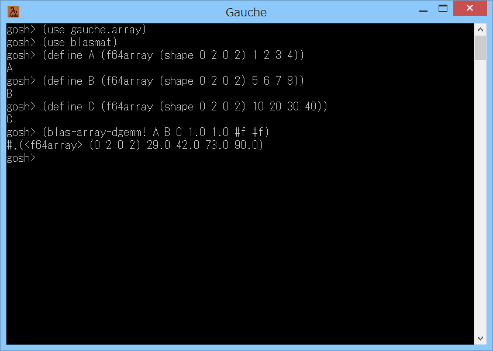

# blasmat



## 概要
- Gauche で、OpenBLAS ライブラリ を使って行列の高速演算を行うためのモジュールです。  
  OpenBLAS は、C/Fortran で書かれた線形代数用のライブラリです ( https://www.openblas.net )。  
  現状、本モジュールは、標準の gauhce.array モジュールにおける  
  2次元の f64array の ごく一部の演算のみが可能です。


## インストール方法
1. Gauche のインストール  
   事前に Gauche がインストールされている必要があります。  
   Windows の場合は、以下のページに Windows用バイナリインストーラ があるので  
   インストールを実施ください。  
   http://practical-scheme.net/gauche/download-j.html  
   (すでにインストール済みであれば本手順は不要です)

2. 開発環境のインストール  
   C言語 の開発環境が必要です。  
   Windows の場合は、以下のページを参考に、MSYS2/MinGW-w64 (64bit/32bit) の  
   開発環境をインストールしてください。  
   https://gist.github.com/Hamayama/eb4b4824ada3ac71beee0c9bb5fa546d  
   (すでにインストール済みであれば本手順は不要です)

3. OpenBLAS ライブラリ のインストール  
   OpenBLAS のホームページ ( https://www.openblas.net ) 等を参照して、  
   OpenBLAS ライブラリのインストールを実施ください。  
   Windows の場合は、以下のように実行してください。  
   ＜MSYS2/MinGW-w64 (64bit) 環境の場合＞  
   プログラムメニューから MSYS2 の MinGW 64bit Shell を起動して、以下のコマンドを実行します。
   ```
     pacman -S mingw-w64-x86_64-openblas
   ```
   ＜MSYS2/MinGW-w64 (32bit) 環境の場合＞  
   プログラムメニューから MSYS2 の MinGW 32bit Shell を起動して、以下のコマンドを実行します。
   ```
     pacman -S mingw-w64-i686-openblas
   ```

4. ファイルのダウンロード  
   本サイト ( https://github.com/Hamayama/blasmat ) のソースを、  
   (Download Zip ボタン等で) ダウンロードして、作業用のフォルダに展開してください。  
   例えば、作業用のフォルダを c:\work とすると、  
   c:\work\blasmat の下にファイル一式が配置されるように展開してください。  
   (注意) 作業用フォルダのパスには、空白を入れないようにしてください。

5. コンパイルとインストール  
   展開したフォルダで、./configure と make install を実行して、  
   インストールを実施ください。  
   Windows の場合は、以下のように実行してください。  
   ＜MSYS2/MinGW-w64 (64bit) 環境の場合＞  
   プログラムメニューから MSYS2 の MinGW 64bit Shell を起動して、以下のコマンドを実行します。  
   ＜MSYS2/MinGW-w64 (32bit) 環境の場合＞  
   プログラムメニューから MSYS2 の MinGW 32bit Shell を起動して、以下のコマンドを実行します。  
   ( c:\work にソースを展開した場合)
   ```
     cd /c/work/blasmat
     ./configure   # Makefile等を生成します
     make          # コンパイルを実行します
     make install  # Gaucheのライブラリフォルダにインストールします
     make check    # テストを実行します
   ```
   (注意) Windows の環境によっては、make install を実行すると  
   「gauche-install: no write permission of ...」もしくは  
   「*** ERROR: mkstemp failed」というエラーが発生します。  
   このエラーは、インストール先のフォルダに書き込み権限がないとき等に発生します。  
   その場合には、プログラムメニューからの開発環境の起動時に右クリックして、  
   「管理者として実行」を選択してください。  
   そして再度上記のコマンドを実行してください。

- 以上です。


## 使い方
- 基本的な使い方は、以下のようになります。
  ```
    (use gauche.array)        ; 標準の行列演算モジュールをロードします。
    (use blasmat)             ; 本モジュールをロードします。
    (define A (f64array (shape 0 2 0 2) 1 2 3 4))     ; 2x2 の 行列A を作成します。
    (define B (f64array (shape 0 2 0 2) 5 6 7 8))     ; 2x2 の 行列B を作成します。
    (define C (f64array (shape 0 2 0 2) 10 20 30 40)) ; 2x2 の 行列C を作成します。
    (blas-array-dgemm! A B C 1.0 1.0 #f #f)           ; C = AB + C を計算します。
    (print C)                 ; 行列C の内容を表示します。
    (print (array-ref C 0 0)) ; 行列C の左上の要素の値を表示します。
    (print (array-ref C 0 1)) ; 行列C の右上の要素の値を表示します。
  ```
- 使用可能な手続きを、以下に示します。  
  (現状、本モジュールは、標準の gauhce.array モジュールにおける  
  2次元の f64array の ごく一部の演算のみが可能です。)

  - `(blas-array-daxpy! alpha A B)`  
    実数alpha と 行列A, B に対して、  
    B = alpha A + B を計算して返します (行列B は変更されます)。

  - `(blas-array-dgemm! A B C alpha beta trans-A trans-B)`  
    行列A, B, C と 実数alpha, beta に対して、  
    C = alpha A B + beta C を計算して返します。  
    trans-A に #t を指定すると、行列A を転置して計算を行います。  
    trans-A に #f を指定すると、行列A を転置しません。  
    trans-B に #t を指定すると、行列B を転置して計算を行います。  
    trans-B に #f を指定すると、行列B を転置しません。  
    (行列A, B は変更されません。行列C は変更されます)


## 注意事項
1. 本モジュールは、標準の gauche.array モジュールの内部情報を使用しています。  
   このため、Gauche の将来の変更で動作しなくなる可能性があります。

2. gauche.array モジュールの share-array 機能には未対応です。


## 参考情報
1. より汎用的な行列演算モジュールである f2arrmat ( https://github.com/Hamayama/f2arrmat ) は、  
   本モジュールが存在すれば、内部で使用します (一部の演算が高速化されます)。


## 環境等
- OS
  - Windows 11 25H2 (64bit)
  - Windows 8.1 (64bit)
- 環境
  - MSYS2/MinGW-w64 UCRT64 (64bit) (gcc version 15.2.0 (Rev8, Built by MSYS2 project))
  - MSYS2/MinGW-w64 (64bit/32bit) (gcc version 9.2.0 (Rev2, Built by MSYS2 project))
- 言語
  - Gauche v0.9.16_pre2
  - Gauche v0.9.9
  - Gauche v0.9.8
  - Gauche v0.9.7
- ライブラリ
  - OpenBLAS v0.3.30
  - OpenBLAS v0.3.7


## 履歴
- 2019-3-17  v1.00 (初版)
- 2019-3-19  v1.01 不要処理削除
- 2019-3-20  v1.02 blas-array-dgemm に転置指定の引数を追加
- 2019-3-20  v1.03 blas-array-dgemm の転置指定の引数を必須に変更(遅くなったため)
- 2019-3-21  v1.04 行列の情報取得をマクロ化
- 2019-3-21  v1.05 手続き名に`!`を追加
- 2019-3-21  v1.06 blas-array-daxpy! の引数順変更
- 2020-1-5   v1.06 README修正のみ(Gauche v0.9.9 で動作確認)
- 2020-1-7   v1.06 Makefile.in変更
- 2026-1-2   v1.07 環境更新


(2026-1-2)
